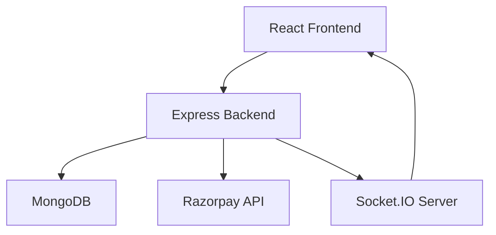
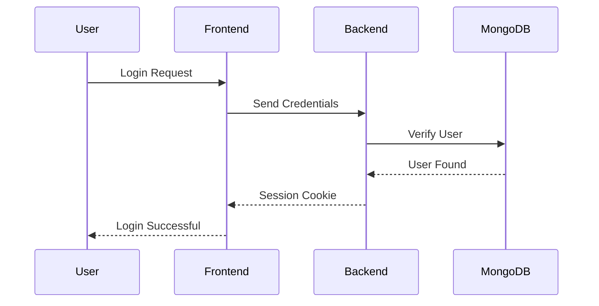
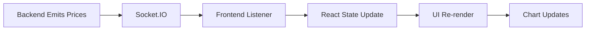
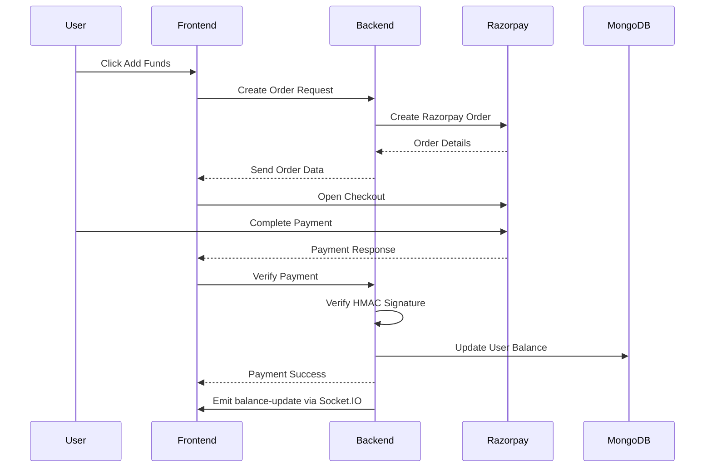

# 🚀 Zerodha Clone – Real-Time Trading Dashboard


A full-stack real-time trading dashboard inspired by Zerodha, built using the MERN stack.

This project simulates the core functionalities of a modern stock trading platform including:

- 🔐 Authentication & Session Management
- ⚡ Real-Time Stock Updates using Socket.IO
- 💳 Razorpay Payment Gateway Integration
- 📈 Portfolio & Holdings Management
- 📊 Interactive Chart Visualizations
- 🧠 Context API State Management
- 🗄️ MongoDB Database Architecture

---

# 🌟 Features

## 🔐 Authentication System
- User Signup/Login
- Session-based Authentication using Passport.js
- Secure password hashing & salting
- Protected backend routes
- Persistent login using cookies & sessions

---

## ⚡ Real-Time Watchlist
- Live stock price updates using Socket.IO
- Event-driven architecture
- Dynamic watchlist rendering
- Real-time chart updates
- Shared socket connection using Context API

---

## 💳 Razorpay Payment Integration
- Secure wallet funding system
- Razorpay checkout integration
- Backend payment verification using HMAC SHA256
- Real-time balance synchronization after successful payment

---

## 📊 Trading Dashboard
- Holdings management
- Position tracking
- Order management
- Profit/Loss calculations
- Interactive chart visualizations

---

## ⚛️ Frontend Architecture
- Component-based React architecture
- Nested routing using React Router
- Context API for global state management
- Dynamic rendering using React Hooks
- Modular & scalable frontend structure

---

# 🏗️ System Architecture



---

# 🔐 Authentication Flow



---

# ⚡ Real-Time Watchlist Flow



---

# 💳 Razorpay Payment Flow



---

# 📂 Project Structure

```bash
ZerodhaClone/
│
├── backend/
│   ├── middleware/
│   ├── model/
│   ├── routes/
│   ├── schemas/
│   ├── index.js
│
├── dashboard/
│   ├── src/
│   │   ├── components/
│   │   ├── context/
│   │   ├── pages/
│
├── frontend/
│   ├── src/
│   │   ├── landing_page/
│
├── README.md
```

---

# 🛠️ Tech Stack

## Frontend
- React.js
- React Router DOM
- Context API
- Material UI
- Chart.js

---

## Backend
- Node.js
- Express.js
- Passport.js
- Socket.IO

---

## Database
- MongoDB
- Mongoose ODM

---

## Payment Gateway
- Razorpay

---

# 🚀 Installation & Setup

## Clone Repository

```bash
git clone https://github.com/your-username/ZerodhaClone.git
```

---

# 📦 Install Dependencies

## Backend

```bash
cd backend
npm install
```

---

## Dashboard

```bash
cd dashboard
npm install
```

---

## Frontend

```bash
cd frontend
npm install
```

---

# ▶️ Run Project

## Start Backend

```bash
npm start
```

---

## Start Dashboard

```bash
npm start
```

---

## Start Frontend

```bash
npm start
```

---

# 🔑 Environment Variables

Create a `.env` file inside the backend folder:

```env
MONGO_URL=your_mongodb_connection_string

SESSION_SECRET=your_session_secret

RAZORPAY_KEY_ID=your_razorpay_key

RAZORPAY_KEY_SECRET=your_razorpay_secret
```

---

# 🧠 Key Engineering Concepts Used

- REST APIs
- Event-Driven Architecture
- Real-Time Communication
- Socket.IO
- React Reconciliation
- Context API
- Session-Based Authentication
- Payment Gateway Integration
- HMAC Signature Verification
- MongoDB Schema Design
- Secure Password Hashing
- React Hooks
- Dynamic State Management

---

# 🚧 Future Improvements

- Redis Pub/Sub for scalable Socket.IO broadcasting
- Webhook-based payment verification
- Advanced analytics dashboard
- Docker deployment
- CI/CD integration
- Order acknowledgement system
- Advanced portfolio insights
- Production-grade caching

---

# 👩‍💻 Author

## Priya R

Full Stack Developer | MERN Stack | Real-Time Systems Enthusiast

---

# ⭐ If you like this project

Give it a ⭐ on GitHub!